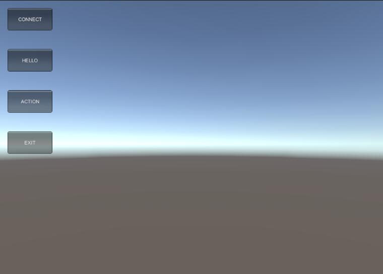

<b>Unity和Python之间Socket通信</b>

现在使用Python 为基础的机器学习工具越来越多了，例如Tensorflow。

很多项目都是使用python来train自己的模型，训练完毕之后，然后导出graph (.bytes文件)。之后复制到unity中加载表现。

unity官方的mechine-learning 例子，就是遵循这样的原则。unity例子github下载链接：<a href="https://github.com/Unity-Technologies/ml-agents">https://github.com/Unity-Technologies/ml-agents</a>

本示例以最简洁的代码，展示了unity和python之间的通信。

操作步骤如下：

1. 打开unity 项目，点击运行

2. 进入Python, 选择main.py 编译运行 此时服务器socket进入监听状态

3. 点击第一个按钮，建立CS连接。 此时服务器的日志可以看到客户端发过来的字段。

4. 点击第二个按钮，客户端不间断的发送Hello World给server

5. 点击第三个按钮，服务器端会发送一个json给客户端

6. 点击第十四个按钮，socket 会断开连接

注意：

socket如何30秒没有连接，服务器会主动断开连接